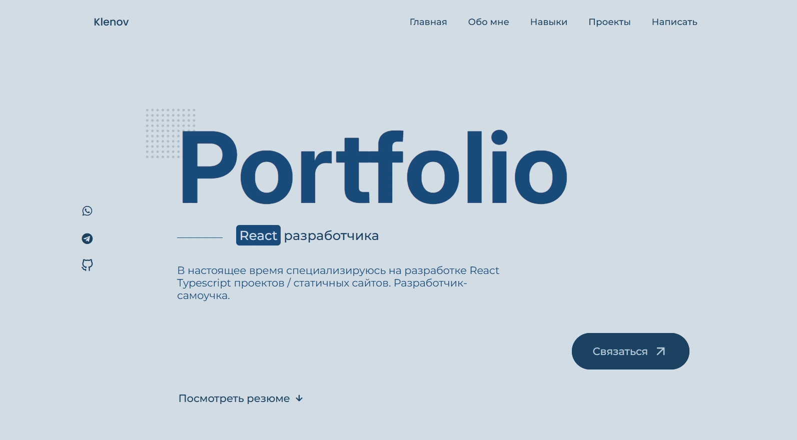

<h1 align="center"> 
  Hey there guys. Here is the portfolio. 
   
</h1> 

 
  
  
I am a front-end developer based in Moscow, specialising in the creation of user interface and user experience (UI/UX) for web pages. This is one of my main projects - portfolio.

  
  

 here is how it looks 

## About portfolio🔎

  
  
  
  
  
  
  

<ul>
  <li> The project is under Apache-2.0 license </li>
  <li> Language: Russian </li>
  <li> The entire project has been developed using the React library. </li>
  <li> The majority of the code utilises the JavaScript programming language. </li>
</ul>

## Would like to ask something?
Here is my [Telegram](https://t.me/tgxzz) and [Whatsapp](https://api.whatsapp.com/send?phone=79964329699)
